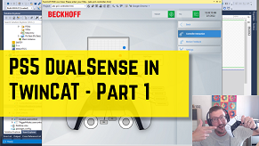
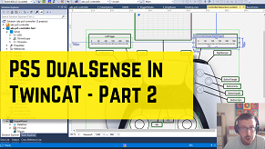
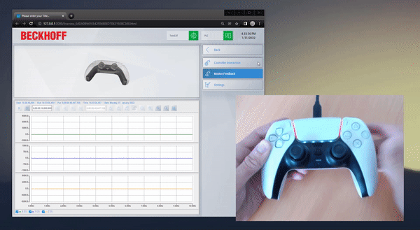

# Simple example of using a PS5 DualSense controller with TwinCAT

## Disclaimer
This is a personal guide not a peer reviewed journal or a sponsored publication. We make
no representations as to accuracy, completeness, correctness, suitability, or validity of any
information and will not be liable for any errors, omissions, or delays in this information or any
losses injuries, or damages arising from its display or use. All information is provided on an as
is basis. It is the reader’s responsibility to verify their own facts.

The views and opinions expressed in this guide are those of the authors and do not
necessarily reflect the official policy or position of any other agency, organization, employer or
company. Assumptions made in the analysis are not reflective of the position of any entity
other than the author(s) and, since we are critically thinking human beings, these views are
always subject to change, revision, and rethinking at any time. Please do not hold us to them
in perpetuity.

## Overview 
This is a proof of concept that you can interface a PS5 DualSense controller to TwinCAT via ADS.  In this example we use a Python script in order to provide the controller wrapper.  This example also shows TwinCAT HMI, 3D model control, TwinCAT HMI Scope among other technologies. 

## Video Tutorial
There is a free coding byte video tutorial on this code which can be found [here](https://codingbytes.teachable.com/p/codingbytes_twincat3)

[](https://codingbytes.teachable.com/p/codingbytes_twincat3) [](https://codingbytes.teachable.com/p/codingbytes_twincat3)

## Getting Started
First start the PLC project running.  Next run the python script on the same IPC as the TwinCAT runtime.  Finally open Desktop.view and start live view by pressing the small [L] on the right hand side.    

## Installation of the Python Code
Download [hidapi](https://github.com/libusb/hidapi/releases) and place the x64 .dll file into your Workspace. After that install the package from [pypi](https://pypi.org/project/pydualsense/). 

```bash
pip install pydualsense
```

Currently there are a few modifications to the original pydualsense code which can be found in the src folder which allow the gyro and accelerometer to function.  These changes may be accepted in to the original repo.  Until then you will need to copy and replace the current pydualsense.py from [here](https://github.com/benhar-dev/pydualsense.git)

## Screenshot


## Versions
* TcXaeShell 3.1.4024.22
* TE2000 1.12.752.0

## Need more help?
Please visit http://beckhoff.com.au/ for further guides

## Acknowledgments

* [Pyads](https://pypi.org/project/pyads/) - ADS library
* [pydualsense](https://github.com/flok/pydualsense) - Python Controller Code
* [iro.js](https://github.com/jaames/iro.js.git) - Color Picker
* [model-viewer](https://github.com/google/model-viewer) - 3D Model Viewer


